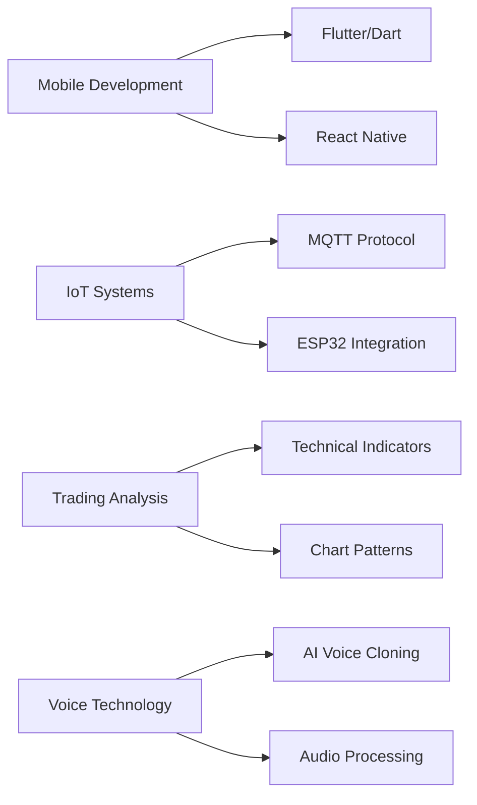

#  Hey there, I'm **Christian**! 👋

<!-- 
 -->
  <!--  -->
<!-- 
 -->

  
  

---

## 👨‍💻 About Me

Hi, I'm **Christian**, a passionate **Full-Stack & IoT Developer** from 🇮🇹 **Italy**.  
I love turning innovative ideas into clean and functional code.

💡 **What I Do:**
- 🌐 Create responsive & modern web/mobile apps  
- 🔐 Explore cybersecurity and automation tools  
- ⚙️ Develop IoT systems with ESP32 & Arduino  
- 📊 Analyze markets and build trading scripts  

🎯 **Current Focus:** Mobile Development & IoT  
📚 **Learning:** Flutter, React Native, MQTT  
🎵 **Interests:** Cybersecurity • Trading • Voice Cloning  
☕ **Fun Fact:** I turn coffee into code and bugs into features!

---

## 🧰 Tech Stack

### 🖋️ Languages  

### ⚛️ Frameworks & Libraries  

### 🗄️ Databases & Backend  

### ⚙️ Tools & Platforms  

### 🔌 IoT & Hardware  

---

## 🌟 Featured Projects

  <table>
    <tr>
      <td width="50%">
        <h3 align="center">🎮 ScalaDash</h3>
        

          
        

        

          <strong>TypeScript • Three.js • Web</strong> 
          An interactive 3D web experience built with modern tech.
        

      </td>
      <td width="50%">
        <h3 align="center">🐾 Capolavoro</h3>
        

          
        

        

          <strong>Arduino • IoT • Smart Systems</strong> 
          A smart pet dispenser with automation and web control.
        

      </td>
    </tr>
    <tr>
      <td width="50%">
        <h3 align="center">🔒 URL-Scan</h3>
        

          
        

        

          <strong>Python • Cybersecurity</strong> 
          Advanced phishing and malware detection tool.
        

      </td>
      <td width="50%">
        <h3 align="center">📊 Quiz Collection</h3>
        

          
        

        

          <strong>HTML • CSS • JavaScript</strong> 
          A curated list of educational quiz platforms.
        

      </td>
    </tr>
  </table>

---

## 📊 GitHub Analytics

  
  

  

  

---

## 🧭 Learning Journey

---

## 💬 Connect With Me

  
  
  
  

---

## 💡 Random Dev Quote

  

---

  
  
  **"Happy coding and keep creating cool stuff!" 🚀**
  
  ⭐ *If you like my projects, give them a star!* ⭐

